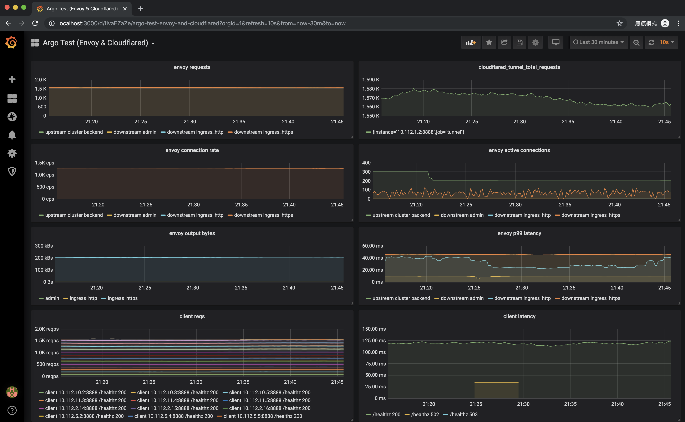

# Cloudflare Argo Load Test Instruction

## Run with local docker-compose

REQUIRED local port: 

    3000  (grafana)
    9090  (prometheus)
    10001 (envoy)
    
Make sure the above ports are free on your machine before running `docker-compose up`.
Or you can change these ports from the `docker-compose.yml`.

REQUIRED file:

    ~/.cloudflared/cert.pem

Make sure you have the `~/.cloudflared/cert.pem` on your machine before running `docker-compose up`,
which can be generated by running `cloudflared tunnel login`.

Then run the following:
```shell script
export TUNNEL_HOSTNAME=tunnel.dcard.tw
docker-compose up
```
Test in another shell:
```shell script
export TUNNEL_HOSTNAME=tunnel.dcard.tw
curl -i https://$TUNNEL_HOSTNAME/healthz # should return http 200
```

Let the client to request the tunnel by changing the value of `Hosts` field in the `./client/config.json` from

    https://envoy

to

    https://tunnel.dcard.tw
  

Finally check the dashboard on http://localhost:3000.
The username and password are both `admin`

## Run on GKE

Use `gke.tf` to create the GKE cluster:

```shell script
terraform init

export TF_VAR_gcp_project_id=your-gcp-project-id
terraform apply
```

Then, get the GKE credentials from gcloud CLI:
```shell script
gcloud container clusters get-credentials argo-test --zone asia-east1-a --project your-gcp-project-id
```

Then, upload `~/.cloudflared/cert.pem` to GKE
```shell script
kubectl create secret generic tunnel-crt --from-file="$HOME/.cloudflared/cert.pem"
```

Then, use `kube.yaml` with `{TUNNEL_DOMAIN}` substitution to deploy pods:

```shell script
cat kube.yaml | sed 's/{TUNNEL_DOMAIN}/.dcard.tw/g' | kubectl apply -f -
```

Then, port-forward the grafana to check the dashboard:
```shell script
kubectl port-forward grafana-0 3000
```
The username and password are both `admin`.

Then, you can adjust the replicas of client, backend, or tunnel:

```shell script
kubectl scale deploy backend --replicas=3
kubectl scale deploy client --replicas=9
kubectl scale deploy tunnel --replicas=2
```

You can also test against GCP Load Balancer directly by changing the `Hosts` field of `client` ConfigMap in `kube.yaml` to the IP address of:

```shell script
kubectl get ingress envoy
```

and re-apply the `kube.yaml` with `{TUNNEL_DOMAIN}` substitution again.

# Test Result on GKE asia-east1-a

## 3 backend pods + 9 client pods -> direct GCP Loadbalancer

10K requests/s. In this test case, the lower latency and higher throughput is expected, because the clients and the server pods are all in the GCP network.


## 3 backend pods + 9 client pods -> cloudflare -> GCP Loadbalancer

1.6K requests/s


## 3 backend pods + 9 client pods -> cloudflare tunnel

1K requests/s


## 3 backend pods + 18 client pods -> cloudflare tunnel

1K requests/s


## 3 backend pods + 24 client pods -> cloudflare -> GCP Loadbalancer

4K requests/s


## 3 backend pods + 24 client pods -> cloudflare tunnel

1.5K requests/s



## 3 backend pods + 30 client pods -> cloudflare -> GCP Loadbalancer

5K requests/s


# The connection pooling issue with cloudfalred 2019.11.3

As showed from the above screenshots, the cloudfalred 2019.11.3 keep creating new http connections to backend.

Related issue: https://github.com/cloudflare/cloudflared/issues/156

Related PR: https://github.com/cloudflare/cloudflared/pull/155